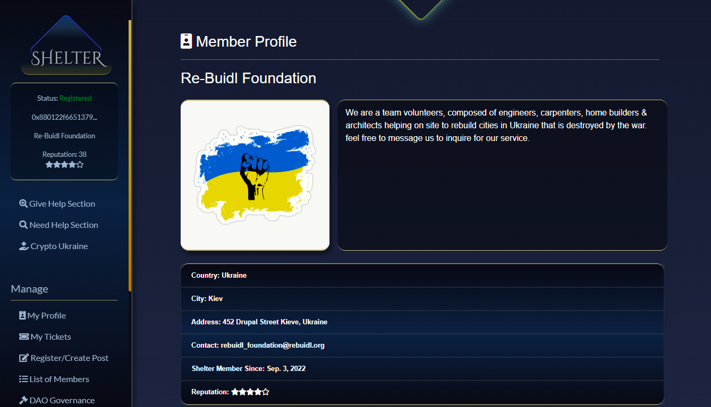
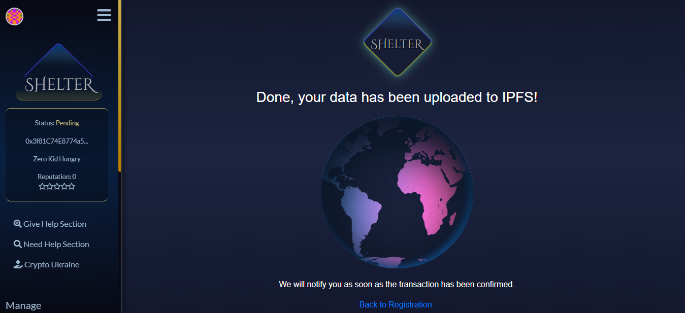

## Kyiv Tech Summit Hackathon Deliverables

1. Website  
* [Try it on traditional website](https://shelter.services)  
   
* [or IPFS Website](https://shelter.on.fleek.co)  

* [Watch the presentation](https://youtu.be/4S_hRp-6A5k)
 

## About Shelter
Shelter is a secure, immutable & decentralized donation platform that aims to maximize the reach & further improve the impact of our humanitarian relief effort. It uses a BLOCKCHAIN-BASED TICKETING SYSTEM that lets refugees & people affected by the war in Ukraine connect,exchange & get donations directly from people that wants to help.
 
 
One of the distrupting features of Shelter is the unique use of tickets. In Shelter, tickets are used primarily to exchange not only goods & items essential to the victims of war, but also services amongst its members. Event organizers could also use shelter to make humanitarian events such as food programs, online medical consultation & community events & leverage the secure & immutable ticketing system of the platform.

 

## Tools & Technology used
* Ethereum - Blockchain Platform           
* Solidity - Smart Contract           
* Truffle - Smart Contract Compilation        
* Ganace-CLI - Smart Contract Deployment      
* Drizzle - Reactive User Interface     
* Web3.js - Blockchain Connection       
* Infura Web3 API - Blockchain Connection     
* Infura IPFS API - IPFS Pinning/Connection     
* IPFS - Decentralized storage    

## Usage of Inter-planetary File System (IPFS)
Shelter uses IPFS as its main file storage & rely heavily into it. Some of important details from the Core Functions of Shelter like REGISTRATION, CALL-FOR-HELP, & LEND-A-HAND are pinned & uploaded into the IPFS.
This is to ensure that the data uploaded by the users of shelter are available anytime & anywhere. this includes all the photos, profile details, event photos & event descriptions.
 

 

## Local
Try it on your Local.
Clone or Download https://github.com/JanMooMoo/shelter.git
In the project directory, you can run:

### `npm install`
Install dependencies of the application.

### `npm start`

Runs the app in the development mode. 
Open [http://localhost:3000](http://localhost:3000) to view it in the browser.

The page will reload if you make edits. 

